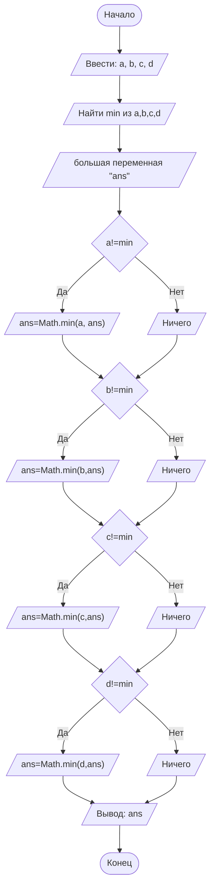

## Отчет по лабораторной работе № 1

#### № группы: `ПМ-2501`

#### Выполнил: `Ушаков Игнат Игоревич`

#### Вариант: `22`

### Cодержание:

- [Постановка задачи](#1-постановка-задачи)
- [Входные и выходные данные](#2-входные-и-выходные-данные)
- [Выбор структуры данных](#3-выбор-структуры-данных)
- [Алгоритм](#4-алгоритм)
- [Программа](#5-программа)
- [Анализ правильности решения](#6-анализ-правильности-решения)

### 1. Постановка задачи

 >Программа получает четыре различных целых числа. Вывести нужно
 >число, которое больше одного и меньше двух других чисел. То есть,
 >если мы отсортируем эти числа по возрастанию,то число на выходе будет стоять вторым

Данную задачу можно разделить на 2 подзадачи: нахождение минимального числа и минимального среди остальных.

- Для 1 подзадачи нужно найти минимальное число среди 4,например,с помощью функции Math
- Для 2 поздачи нужно найти минимальное из 3 оставшихся, используя новую переменную,в которой будет записано заведомо огромное число.

  ### 2. Входные и выходные данные

#### Данные на вход

На вход программа должна получать 4 ЦЕЛЫХ числа. Верхняя и нижняя границы получаемых
чисел следующие:

|         | Тип              | min значение    | max значение   |
|---------|------------------|-----------------|----------------|
| Число 1 | Целое число      | -2<sup>31</sup> |2<sup>31</sup>-1|
| Число 2 | Целое число      | -2<sup>31</sup> |2<sup>31</sup>-1|
| Число 1 | Целое число      | -2<sup>31</sup> |2<sup>31</sup>-1|
| Число 2 | Целое число      | -2<sup>31</sup> |2<sup>31</sup>-1|


#### Данные на выход

Т.к. программа должна вывести одно из входных чисел, то на выход мы получим
единственное целое число, большее -2<sup>31</sup> и меньшее 2<sup>31</sup>-1.

|         | Тип               | min значение    | max значение     |
|---------|-------------------|-----------------|------------------|
| Число 1 | Целое             | -2<sup>31</sup> |2<sup>31</sup>-1  |

### 3. Выбор структуры данных

Программа получает 4 целых числа,большее -2<sup>31</sup> и меньшее 2<sup>31</sup>-1. Поэтому для их хранения
можно выделить 4 переменных (`a`,`b`,`c` и `d`) типа `int`.

|         | название переменной | Тип (в Java) | 
|---------|---------------------|--------------|
| Число 1 | `a`                 | `int`        |
| Число 2 | `b`                 | `int`        | 
| Число 3 | `c`                 | `int`        |
| Число 4 | `d`                 | `int`        | 


### 4. Алгоритм

#### Алгоритм выполнения программы:

1. **Ввод данных:**  
   Программа считывает 4 целых числа, обозначенные как `a`,`b`,`c` и `d`.

2. **Нахождение минимального:**  
   Программа находит минимальное число среди данных 4.

3. **Нахождение минимального среди оставшихся трех чисел:**

   Для начала создаем переменную с большим числом(2<sup>31</sup>-1),чтобы дальше сохранять в эту переменную минимальное число.
   - Если первое число не является минимальным среди 4, то мы сравниваем "большую переменную" и первое число.
     Результат добавляем в "большую переменную".
   
   Абсолютно аналогичный алгоритм мы проделываем с другими входными числами. Выводим "большую переменную"

5. **Вывод результата:**  
   Таким образом, на экран выводится число которое не является самым минимальным,но меньше двух других. То есть,это число в отсортированной 
   последовательности стояло бы вторым.


#### Блок-схем



### 5. Программа

```java
import java.io.PrintStream;
import java.util.Scanner;
public class Main {
    // Объявляем объект класса Scanner для ввода данных
    public static Scanner in = new Scanner(System.in);
    // Объявляем объект класса PrintStream для вывода данных
    public static PrintStream out = System.out;
    public static void main(String[] args) {
        // Считывание четырех целых чисел a,b,c,d из консоли
        int a = in.nextInt();
        int b = in.nextInt();
        int c = in.nextInt();
        int d = in.nextInt();
        // Определение минимального числа
        int min = Math.min(Math.min(a,b),Math.min(c,d));
        //создадим переменную с заведомо большим числом
        int ans = (1 << 31)-1;
        //Если число не минимально,то запихиваем ее в переменную.
        //Сделав так с каждым числом,в итоге получим минимальное из оставшихся трех
        if (a != min) {
            ans=Math.min(a, ans);
        }
        if (b!=min){
            ans=Math.min(b,ans);
        }
        if (c!=min){
            ans=Math.min(c,ans);
        }
        if (d!=min){
            ans=Math.min(d,ans);
        }
        out.println(ans);
    }
}
```
### 6. Анализ правильности решения

Программа работает корректно на всем множестве решений с учетом ограничений.

1. Тест на положительные числа:

    - **Input**:
        ```
        5 122 313 26
        ```

    - **Output**:
        ```
        26
        ```

2. Тест на отрицательные числа:

    - **Input**:
        ```
        -25 -129 -2 -83
        ```

    - **Output**:
        ```
        -83
        ```

3. Тест на множестве целых чисел:

    - **Input**:
        ```
        10 -120 432 -12
        ```

    - **Output**:
        ```
        -12
        ```
