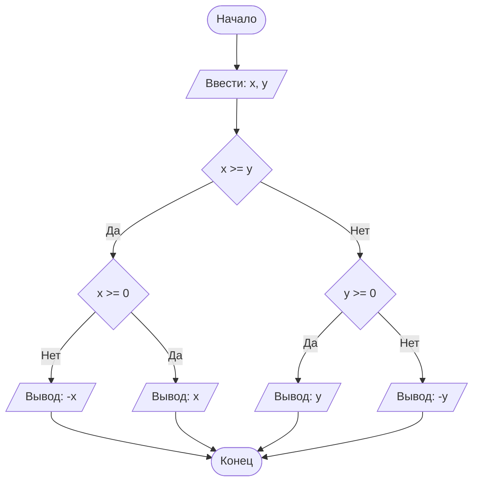

## Отчет по лабораторной работе № 1

#### № группы: `ПМ-2501`

#### Выполнил: `Ушаков Игнат Игоревич`

#### Вариант: `22`

### Cодержание:

- [Постановка задачи](#1-постановка-задачи)
- [Входные и выходные данные](#2-входные-и-выходные-данные)
- [Выбор структуры данных](#3-выбор-структуры-данных)
- [Алгоритм](#4-алгоритм)
- [Программа](#5-программа)
- [Анализ правильности решения](#6-анализ-правильности-решения)

### 1. Постановка задачи

 >Программа получает четыре различных целых числа. Вывести нужно
 >число, которое больше одного и меньше двух других чисел. То есть,
 >если мы отсортируем эти числа по возрастанию,то число на выходе будет стоять вторым

Данную задачу можно разделить на 2 подзадачи: нахождение максимального числа и получение модуля этого числа.

- Для 1 подзадачи нужно найти минимальное число среди 4
- Для 2 поздачи нужно найти минимальное из 3 оставшихся

  ### 2. Входные и выходные данные

#### Данные на вход

На вход программа должна получать 4 ЦЕЛЫХ числа. Верхняя и нижняя границы получаемых
чисел следующие:

|         | Тип              | min значение    | max значение   |
|---------|------------------|-----------------|----------------|
| Число 1 | Целое число      | -231 |109-1|
| Число 2 | Целое число      | -231 |231-1|
| Число 1 | Целое число      | -231 |109-1|
| Число 2 | Целое число      | -231 |231-1|

#### Данные на выход

Т.к. программа должна вывести одно из входных чисел, то на выход мы получим
единственное целое число, большее -231 и меньшее 231-1.

|         | Тип               | min значение    | max значение     |
|---------|-------------------|-----------------|------------------|
| Число 1 | Целое             | -231 |231-1  |

### 3. Выбор структуры данных

Программа получает 2 вещественных числа, не превышающих по модулю 109 < 230. Поэтому для их хранения
можно выделить 2 переменных (`x` и `y`) типа `double`.

|         | название переменной | Тип (в Java) | 
|---------|---------------------|--------------|
| Число 1 | `a`                 | `int`        |
| Число 2 | `b`                 | `int`        | 
| Число 3 | `c`                 | `int`        |
| Число 4 | `d`                 | `int`        | 

Для вывода результата необязательно его хранить в отдельной переменной.

